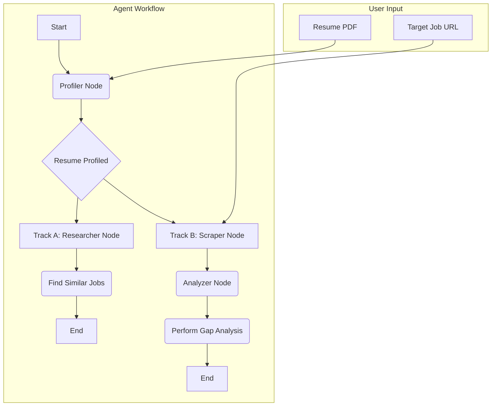

# CareerAgent

An intelligent agent that analyzes your resume against a target job description while simultaneously discovering other similar opportunities for you.


## Overview

*CareerAgent* is a Streamlit web application that leverages the power of Large Language Models (LLMs) and graph-based agentic workflows to provide a dual-track career analysis. It helps job seekers in two primary ways:

1.  **Deep Dive Analysis:** It performs a detailed "gap analysis" by comparing your resume to a specific job you're interested in, providing a match score, identifying missing keywords, and offering concrete advice on how to tailor your resume.
2.  **Opportunity Discovery:** It intelligently creates a search query based on your professional profile and scours the web to find other relevant job openings that you might have missed.

This tool is built to streamline the job application process, making it more efficient and strategic.


## Key Features

-   **Resume Profiling:** Automatically extracts a professional summary and key skills from your PDF resume.
-   **Target Job Analysis:** Scrapes a target job URL and performs an in-depth gap analysis.
-   **Automated Job Search:** Uses an AI-generated query to find similar job roles from the web.
-   **Agentic Workflow:** Built with LangGraph to orchestrate multiple LLM calls and tool uses in a robust, stateful manner.
-   **Interactive UI:** A simple and clean user interface built with Streamlit.

## Architecture

The application uses a combination of modern AI and web development tools:

-   **Frontend:** `Streamlit` for the interactive user interface.
-   **Core Logic:** `LangGraph` to define and run the agentic workflow as a state machine.
-   **LLM:** Google's `Gemini 2.5 Flash` via the `langchain-google-genai` library for all reasoning and generation tasks.
-   **Web Search:** `Tavily` for real-time job searching.
-   **Web Scraping & PDF Processing:** `langchain-community` (WebBaseLoader) and `pypdf` for data extraction.

### Workflow Diagram

The agent's logic is structured as a graph. It starts by profiling the user's resume and then splits into two parallel tracks: one for analyzing the target job and another for finding new jobs.



## How It Works

1.  **Input:** The user uploads their resume (PDF) and provides a URL for a target job posting.
2.  **Profiler Node:** The agent starts by reading the resume text. It then calls the LLM to generate a professional summary and an optimized job search query (e.g., "Junior Python Developer").
3.  **Parallel Tracks:**
    *   **Track A (Research):** The `researcher_node` takes the generated search query and uses the Tavily search tool to find 5 recent and relevant job postings.
    *   **Track B (Analysis):** The `scraper_node` fetches the text content from the target job URL. This content is then passed to the `analyzer_node`.
4.  **Analyzer Node:** This node receives the resume text and the scraped job description. It calls the LLM with a specific prompt to perform a gap analysis, generating a match score, a list of missing keywords, and resume tailoring advice.
5.  **Output:** The Streamlit UI displays the results from both tracks: the detailed gap analysis on one side and the list of newly found job opportunities on the other.

## Getting Started

Follow these instructions to set up and run the project locally.

### Prerequisites

-   Python 3.9+
-   An active internet connection

### 1. Clone the Repository

```bash
git clone https://github.com/ashhssn/CareerAgent.git
cd CareerAgent
```

### 2. Set Up a Virtual Environment

It's recommended to use a virtual environment to manage dependencies.

```bash
# For Windows
python -m venv venv
venv\Scripts\activate

# For macOS/Linux
python3 -m venv venv
source venv/bin/activate
```

### 3. Install Dependencies

Install all the required packages from the `requirements.txt` file.

```bash
pip install -r requirements.txt
```

### 4. Configure Environment Variables

You will need API keys for Google (for the Gemini model) and Tavily (for web search).

1.  Create a file named `.env` in the root of the project directory.
2.  Add your API keys to this file:

    ```env
    GOOGLE_API_KEY="your_google_api_key_here"
    TAVILY_API_KEY="your_tavily_api_key_here"
    ```

### 5. Run the Application

Launch the Streamlit app using the following command:

```bash
streamlit run app.py
```

The application should now be open and running in your web browser!

